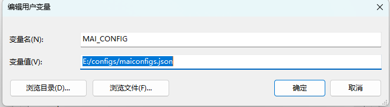

## 开发说明

在项目的 `configs` 目录提供各类配置模板，可参考该目录下的文件。

### 配置

项目支持环境变量和文件注入配置，建议统一 configs 目录统一管理配置文件。

创建环境变量，`MAI_CONFIG`，设置变量值为配置文件路径，配置文件支持 `.json`、`.yaml`、`.conf` 等类型。

如：

```
MAI_CONFIG = E:/configs/maiconfigs.json
```




使用 docker 启动时，可以通过 `docker -v /data/config:/app/configs -e MAI_CONFIG=/app/configs/system.yaml` 的形式向服务提供配置文件。

### 指定端口
默认服务使用 8080 端口启动服务，如果需要改变，可以添加环境变量。

```
ASPNETCORE_HTTP_PORTS=80;8080
ASPNETCORE_HTTPS_PORTS=443;8081
```

或者

```
ASPNETCORE_URLS=http://*:80/;http://*:8080/;https://*:443/;https://*:8081/
```

### 日志

你可以在 configs 目录下创建一个 logger.json 文件，MaomiAI 启动时会读取该文件作为日志配置，如果文件不存在则会自动创建一个默认的。

默认配置如下：

```
{
  "Serilog": {
    "Using": [
      "Serilog.Sinks.Console"
    ],
    "MinimumLevel": {
      "Default": "Information",
      "Override": {
        "Microsoft.AspNetCore.HttpLogging": "Information",
        "ProtoBuf.Grpc.Server.ServicesExtensions.CodeFirstServiceMethodProvider": "Warning",
        "Microsoft.EntityFrameworkCore": "Information",
        "Microsoft.AspNetCore": "Warning",
        "System.Net.Http.HttpClient.TenantManagerClient.LogicalHandler": "Warning",
        "Microsoft.EntityFrameworkCore.Database.Command.CommandExecuted": "Warning",
        "System": "Information",
        "Microsoft": "Information",
        "Grpc": "Information",
        "MySqlConnector": "Information"
      }
    },
    "WriteTo": [
      {
        "Name": "Console",
        "Args": {
          "outputTemplate": "{SourceContext} {Scope} {Timestamp:HH:mm} [{Level}]{NewLine}{Properties:j}{NewLine}{Message:lj} {Exception} {NewLine}"
        }
      }
    ],
    "Enrich": [
      "FromLogContext",
      "WithMachineName",
      "WithThreadId"
    ]
  }
}
```

